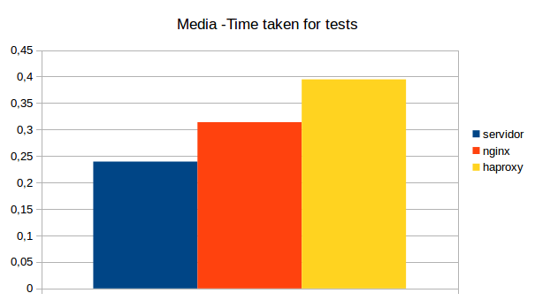
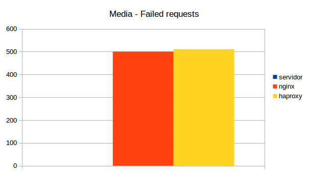
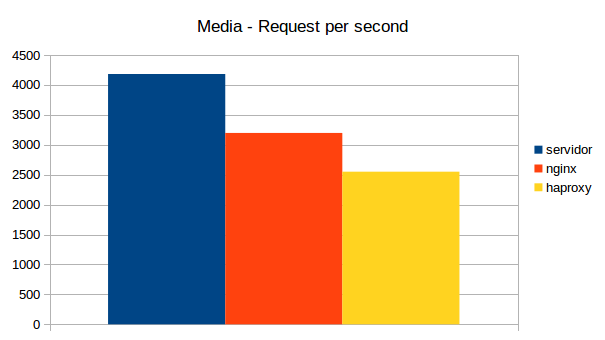
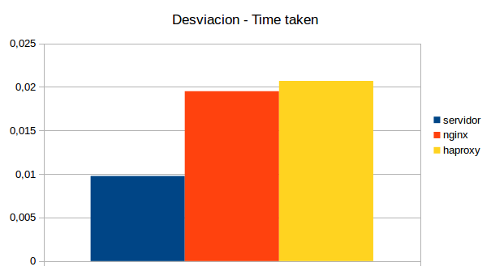
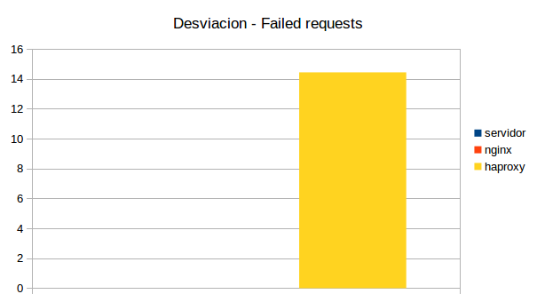
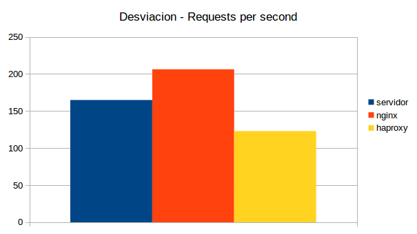
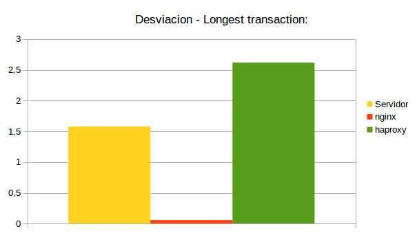
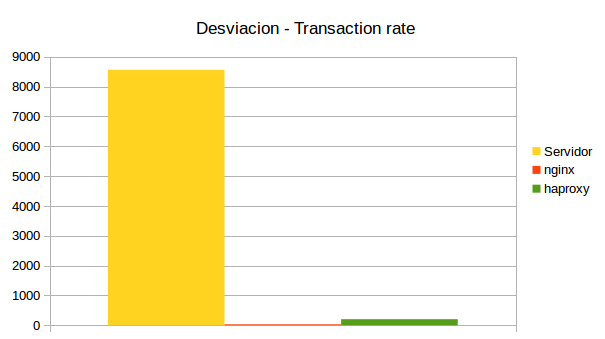

#Práctica 4. Comprobar el rendimiento de servidores web

El objetivo de esta práctica es medir el rendimiento de los servidores que se han montando en las prácticas anteriores.

Para ello se van a utilizar dos herramientas:

* Apache Benchmark
* Siege

Vamos a ejecutar cada herramienta un total de 10 veces para cada uno de los siguientes escenarios:

* Servidor final
* Balanceador con nginx
* Balanceador con haproxy

Para mas información sobre los resultados consultar [aqui](Resultados/ "Resultados")

##Resultados Apache Benchmark

### Media de los resultados

### Desviación de los resultados

##Resultados Siege

### Media de los resultados

### Desviación de los resultados

