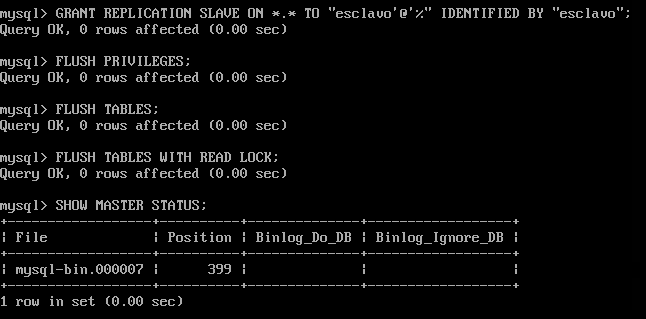
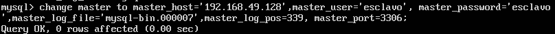
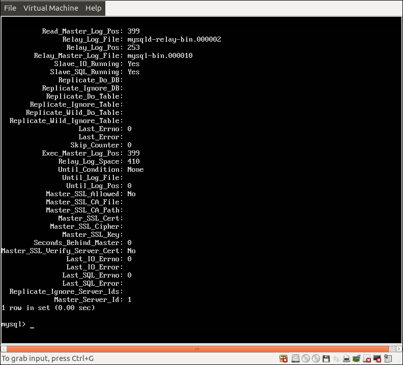
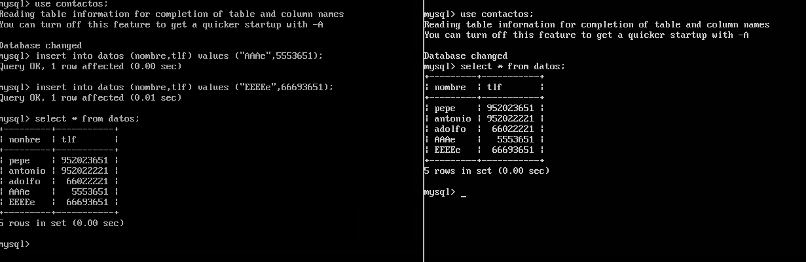

#Práctica 5. Replicación de bases de datos MySQL

El objetivo de esta práctica es realizar copias de seguridad entre nuestras bases de datos MySQL, mediante la técnica maestro-esclavo

##Crear una BD e insertar datos

Para crear una BD lo primero es entrar en la interfaz de MySQL

~~~
mysql -uroot -p
~~~

Una vez dentro creamos una base de datos, una tabla e introducimos valores en dicha tabla

~~~
create database contactos;

use contactos;

create table datos(nombre varchar(100),tlf int);

insert into datos(nombre,tlf) values ("pepe",95834987);
~~~ 

Tras esto tendremos datos en la BD datos.

##Replicar una BD MySQL con mysqldump

Para replicar la BD debemos realizar lo siguiente en el servidor 
principal
~~~
mysql -u root -p

FLUSH TABLES WITH READ LOCK;
quit;
~~~

De esta manera nos aseguramos de que la BD no este actualizándose mientras la copiamos.

Ahora guardamos los datos en la maquina principal.
~~~
mysqldump contactos -u root -p > /root/contactos.sql
~~~

Despues de esto podemos desbloquear las tablas de la BD

~~~
UNLOCK TABLES;
~~~

Y finalmente realizamos la copia a la máquina esclavo.

Para ello copiamos el archivo contactos.sql a la máquina esclavo
~~~
scp alex@192.168.49.128:/root/contactos.sql /root/
~~~

Creamos manualmente la base de datos y la restauramos usando el archivo que ha sido copiado de la máquina principal

~~~
mysql -u root -p
CREATE DATABASE contactos;
quit

mysql -u root -p contactos < /root/co

ntactos.sql
~~~

##Replicación de BD mediante una configuración maestro-esclavo

Lo primero es editar lo siguiente del archivo de configuración de mysql de la máquina que va a actuar como maestro.

Comentamos con un # `bind-address 127.0.0.1` y se lo quitamos a `server-id = 1`

Tras realizar las modificaciones reiniciamos el servicio
~~~
/etc/init.d/mysql restart
~~~

Para la maquina esclava realizamos las mismas modificaciones excepto que el valor de `server-id` es 2

Después de esto crearemos en la máquina maestro un usuario con acceso para la replicación

Configuramos la máquina esclava con los datos del usuario creado.

Para comprobar que todo va bien ejecutamos mysql > SHOW SLAVE STATUS\G y observamos que el valor de la variable "Seconds_Behind_Master" es distinto de "null"

Por último insertamos valores en una BD del maestro para comprobar que la configuración maestro-esclavo funciona correctamente
 

