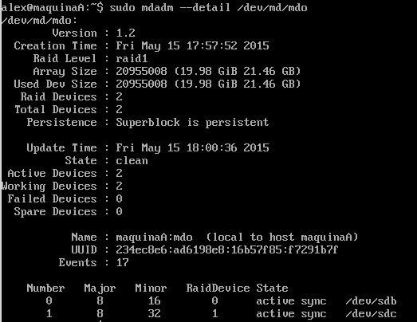
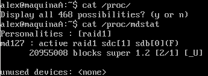
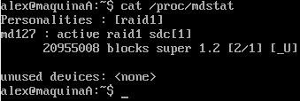
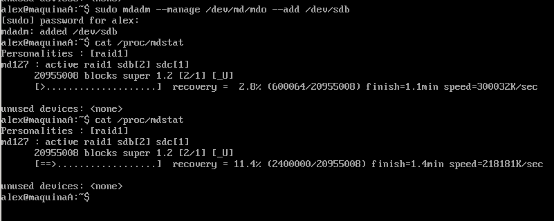

#Práctica 6. Discos en RAID

El objetivo de esta práctica es configurar dos discos en RAID1 (estos discos se añaden en esta práctica) y comprobar que dicho RAID funciona correctamente.

##Configuración del RAID

Antes de configurar debemos añadir dos discos duros estando la máquina apagada, tras esto instalamos `mdadm` y montamos el RAID.

~~~
sudo apt-get install mdadm
sudo mdadm -C /dev/md/mdo --level=raid1 --raid-devices=2 /dev/sdb /dev/sdc
sudo mkdir /datos
sudo mount /dev/md/mdo /datos
~~~
  
Siendo `/dev/sdb` y `/dev/sdc` los dos nuevos discos.

Para comprobar el estado del RAID ejecutamos

~~~
sudo mdadm --detail /dev/md0
~~~

##Simulación de fallo RAID

Para simular un fallo en uno de los discos del RAID utilizamos

~~~
mdadm --manage /dev/md/mdo --fail /dev/sdb
~~~

Comprobamos la información de `/proc/mdstat`

Podemos ver que nos indica que el RAID sigue funcionando, aunque el disco sdb tenga un fallo.

Ahora eliminamos el disco defectuoso y volvemos a comprobar la información de `/proc/mdstat`

~~~
mdadm --manage /dev/md/mdo --remove /dev/sdb
~~~

El RAID sigue operativo a pesar de contar con solo una unidad, en este caso sdc

Volvemos a añadir el disco que hemos retirado con `mdadm --manage /dev/md/mdo --add /dev/sdb` y se comprueba la información de `/proc/mdstat`

Apreciamos como el disco que acabamos de añadir se esta "recuperando"

